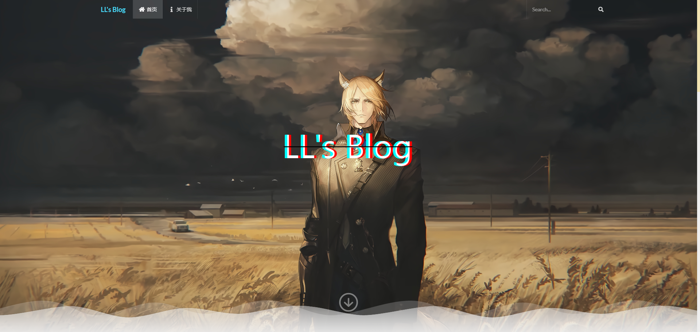
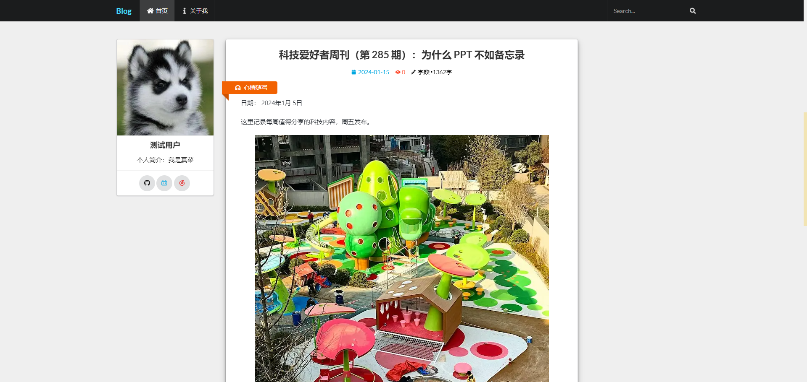
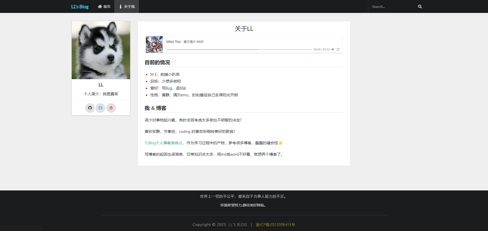
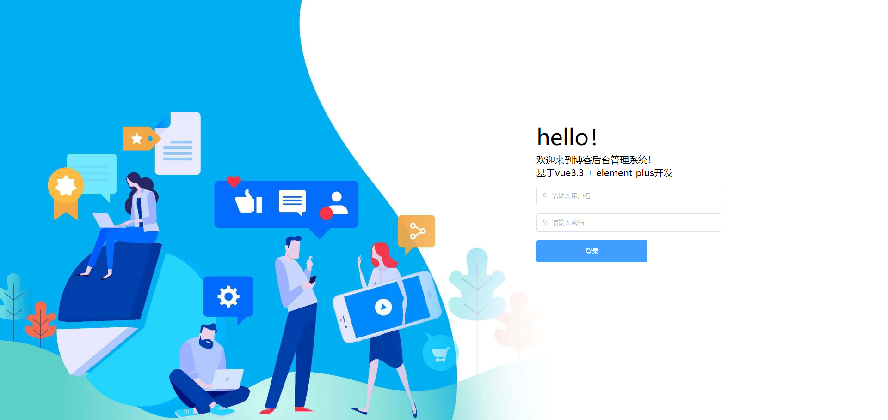
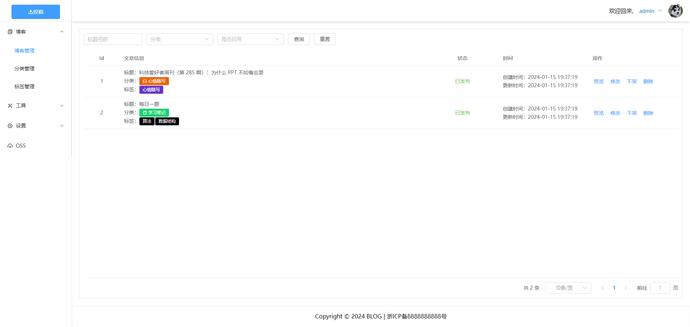
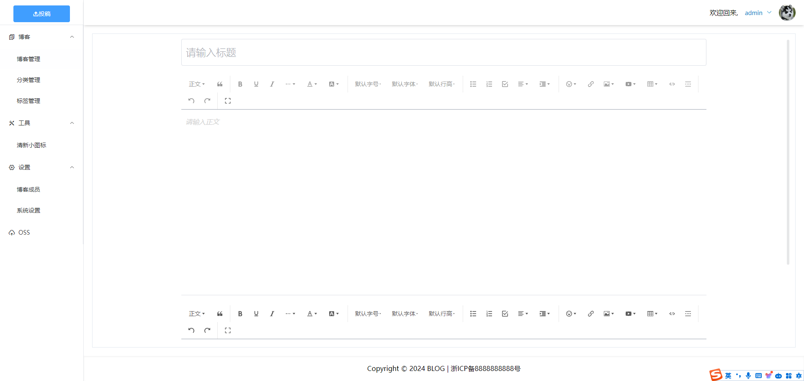
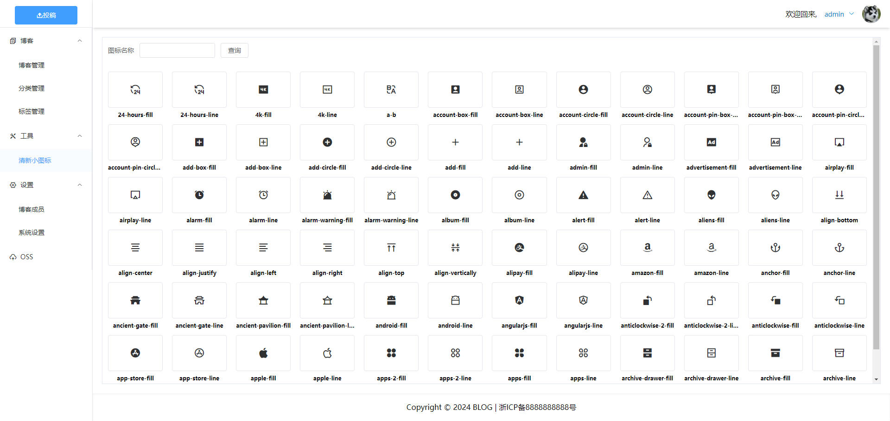

<div align="center">


# LBlog

学有所成后的第一个个人项目

记录平日的技术提升

还是有挺多瑕疵的, 会继续努力！

静待美好降临  ✿✿ヽ(°▽°)ノ✿<br>

</div>

## 使用说明
博客前端和后台管理，采用Vue3+ts。
博客后端，采用express，sequelize框架。

v1.0打通博客基本流程, 以后版本可能新界面, 或优先满足功能如评论。

### front
博客前台页面，直接上图。





### cms
博客后台页面，直接上图。





### back
博客后端。
前台和后台管理共用一套控制器。

```bash
nodemon ./main.js
```

```bash
# 根目录.env配置文件
APP_PORT = 10200

MYSQL_HOST=localhost
MYSQL_PORT=3306
MYSQL_USER=root
MYSQL_PWD=xxxxxxx 
MYSQL_DB=blog

JWT_SECRET=uxDZlJ7cxwUrnVOi
```
