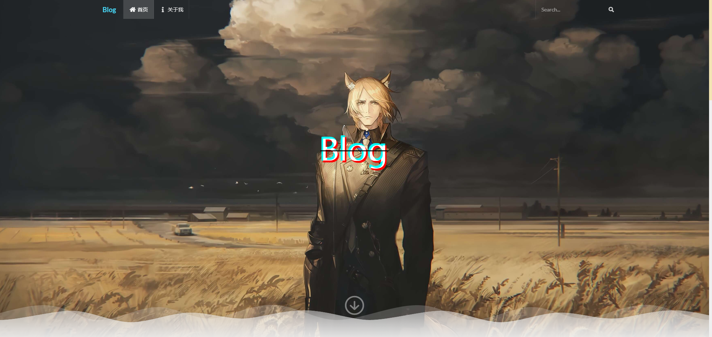
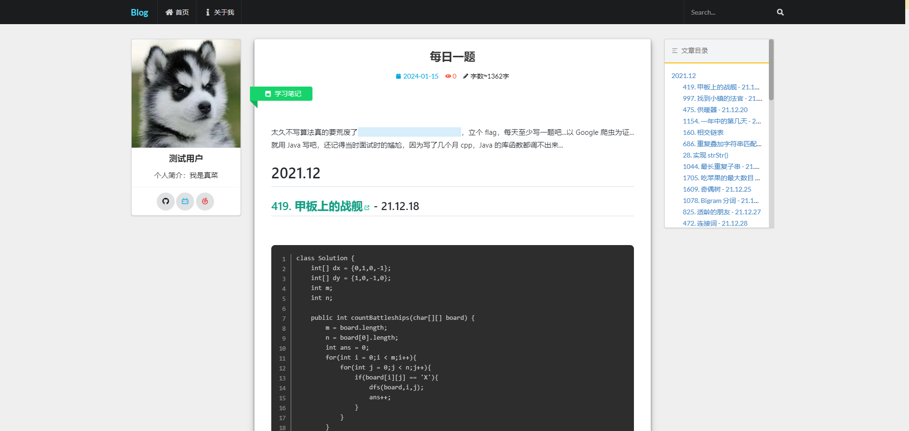
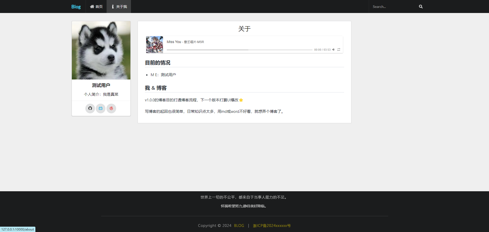

<div align="center">


# LBlog

学有所成后的第一个个人项目

记录平日的技术提升

还是有挺多瑕疵的, 会继续努力！

静待美好降临  ✿✿ヽ(°▽°)ノ✿<br>

</div>

## 使用说明
博客前端和后台管理，采用Vue3+ts。
博客后端，采用express，没有使用任何的ORM框架，维护成本比较大。

### blog-web
博客前台页面，直接上图。





### blog-cms
博客后台页面，直接上图。


### blog-server
博客后端。
前台和后台管理共用一套控制器。

```bash
# 前台服务
node ./app/web.js

# 后台服务
node ./app/cms.js
```
